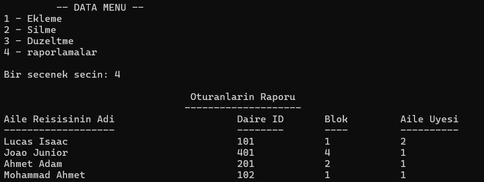

# 🏢 Condominium Management System (Console App)

The application is a console-based condominium management system that manages apartments, residents, payments, and access control for shared facilities such as swimming pools and fitness centers.

---

## 🛠 Technologies

- C++

---

## ✨ Features

- Apartment management
- Resident management
- Payment management
- Swimming pool and fitness access control
- Data and payment reports

---

## 📸 Screenshots

### Data Report


---

## 📄 Documentation

The `docs` folder contains:

- Project Report
- UML Class Diagram
- Original Project Specification

---

## ▶️ How to Run

### Using G++

Compile the source code:

```bash
g++ CondominiumSystem.cpp -o CondominiumSystem
```

Run the application:

```bash
./CondominiumSystem
```

> On Windows (MinGW):

```bash
CondominiumSystem.exe
```

Make sure the following text files remain in the same directory as the executable:

- `Data.txt`
- `Fitness.txt`
- `HavuzKul.txt`
- `Mekan.txt`
- `Odeme.txt`

These files are used by the application for data storage.

### Using Visual Studio

Create a **Console App (C++)** project, add `CondominiumSystem.cpp` to the project, build (`Ctrl + Shift + B`), and run (`Ctrl + F5`).

---

## 🎓 Academic Context

- Sakarya University, Computer Engineering Department
- Introduction to Programming, 2024–2025
