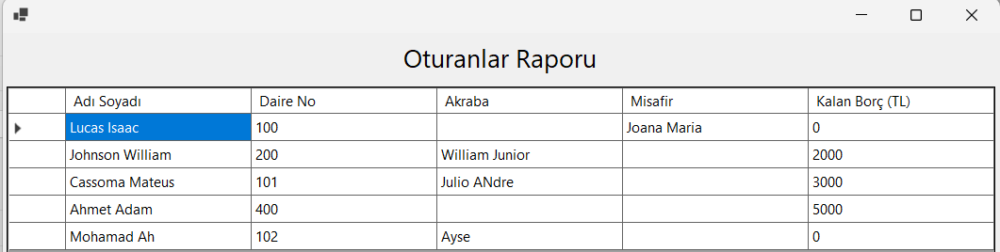

# 🏢 Condominium Management System (Console App)

The application is a desktop-based condominium management system that manages buildings, apartments, residents, payments, and access control for shared facilities such as swimming pools and fitness centers.

---

## 🛠 Technologies

- C#
- .NET WinForms

---

## ✨ Features

- Building management
- Apartment management
- Resident management
- Payment management
- Swimming pool and fitness center access control
- Data and payment reports
- CRUD operations (Create, Read, Update, Delete)
- File-based data persistence

---

## 📸 Screenshots

### Reports

---

## 📄 Documentation

The `docs` folder contains the original Project Specification

---

## ▶️ How to Run

1. Open the solution (`.sln`) using **Visual Studio**.
2. Restore NuGet packages if necessary.
3. Build the solution (`Ctrl + Shift + B`).
4. Run the application (`Ctrl + F5`).

The application uses the following text files for data persistence:

- `Data.txt`
- `Mekan.txt`
- `Odeme.txt`
- `Fitness.txt`
- `HavuzKul.txt`

Make sure these files remain in the application's working directory.

---

## 🎓 Academic Context

- Sakarya University, Computer Engineering Department
- Object-Oriented Programming, 2024–2025
