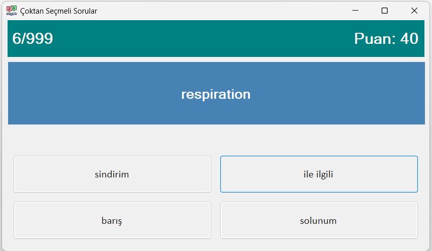

# 🎮 English–Turkish Vocabulary Quiz App

An interactive Windows Forms desktop application developed in C# to practice and test English–Turkish vocabulary through customizable, randomized quizzes.

---

## 🛠 Technologies

- C#
- .NET WinForms

---

## Features

- English–Turkish vocabulary quiz
- Multiple-choice questions
- Randomized answer options
- Score tracking
- Graphical user interface (Windows Forms)

---

## 📄 Documentation

The `/KelimeEzberleme/docs` folder contains the original Project Specification.

---

## 📷 Screenshot

### Main Interface



---

## ▶️ Building from Source


1. Clone the repository:
   ```bash
   git clone [https://github.com/lucaskatalahali/vocabulary-quiz-app.git](https://github.com/lucaskatalahali/vocabulary-quiz-app.git)
2. Open the solution (.sln) in Visual Studio or your preferred IDE.

3. Build and launch the application using F5 or Ctrl + F5 (or via CLI with dotnet run --project KelimeEzberleme).

---

## 🎓 Academic Context

- Sakarya University, Computer Engineering Department
- Object-Oriented Programming, 2024–2025